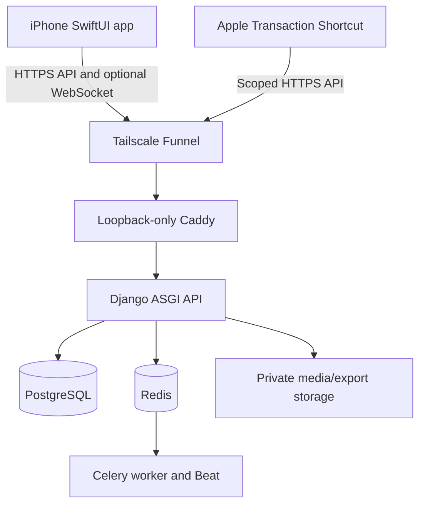

# Architecture

## System context

The app’s SwiftData store is the immediate UI source. Django is the durable multi-device, collaboration, authorization, and backup authority. A user action succeeds locally after the domain write and outbox mutation commit together; networking is a later reconciliation step.

## Trust boundaries

| Boundary | Publicly reachable | Authentication | Sensitive state |
|---|---:|---|---|
| Tailscale Funnel hostname | Yes | TLS transport only; not application auth | None |
| Caddy loopback service | Only through Funnel/local host | Path allow/deny and security headers | No credentials persisted |
| `/api/v1` Django API | Selected routes | Bearer access JWT or narrow Shortcut token | Authorization/domain services |
| Private admin | No | Tailnet/SSH plus Django staff session/CSRF | Administrative controls |
| PostgreSQL | No | Internal service credential | Financial/account/audit metadata |
| Redis | No | Internal network and service configuration | Queues/cache/invalidation only |
| Private media/exports | No raw directory | Authenticated API or expiring grant | Receipts and reports |
| iOS local container | Device-local | iOS Data Protection; optional Face ID UI lock | Synced data, outbox, files, Keychain tokens |

## Backend boundaries

- `apps.common`: UUID/timestamp primitives, request context, error envelope, safe logs, health/config.
- `apps.users`: identity, profiles, device sessions, access JWT validation, rotating refresh credentials.
- `apps.audit`: append-only safe security/administrative audit events.
- Milestone 2 domain apps: trackers, ledger, taxonomy, currency.
- `sync`: transactional reference change log, strict offline command transport, signed cursors, per-user operation receipts, bootstrap, acknowledgement, retention cleanup, and sequence-only Channels fan-out.
- `apps.shortcut`: independently keyed scoped credentials, narrow lookup/capture endpoints, user-scoped idempotency receipts, and scheduled receipt expiry.
- Later apps: planning, sharing, attachments, analytics/exports.

Core financial changes are performed by domain services inside database transactions. REST serializers validate transport shapes; models/constraints protect persistence invariants; views coordinate permissions and service calls.

## Native iOS boundaries

- **App/UI:** SwiftUI feature views, navigation, accessibility, localized presentation.
- **Domain:** money/currency types, commands, calculations, validation, conflict decisions.
- **Persistence:** SwiftData models, atomic local writes/outbox, cursor/bootstrap staging, conflicts, and a durable attachment-transfer queue boundary.
- **Networking:** URLSession DTOs, Keychain-backed session refresh, reachability hint, retry policy.
- **Synchronization actor:** one serialized coordinator per local store; push then pull; independent conflicts.
- **Platform services:** Vision OCR, camera/files, LocalAuthentication, best-effort BackgroundTasks.

No view binds directly to a remote response. WebSockets carry invalidation hints only; they never contain authoritative financial payloads.

Foreground sockets authenticate the same short-lived device-bound access JWT as HTTP and close at token expiry. The client then pulls authorized changes over HTTPS. Active timers, foreground entry, manual retry, and local-change triggers preserve correctness without Redis/Channels. Connectivity monitoring and BackgroundTasks add opportunities to sync but are not schedulers of record.

### Implemented local foundation

- Every local entity and outbox record carries a scope composed from the normalized server origin and the authenticated JWT user UUID. Queries never expose another scope after an account/server change.
- Tracker, account, category, transaction, derived movement/allocation, conversion snapshot, and outbox changes execute through a main-actor repository and one rollback-guarded `ModelContext.save()`. Any enqueue or save failure rolls the complete local command back.
- `SyncCursor.nextOutboxSequence` allocates a monotonically increasing per-scope sequence in the same store transaction. Push order therefore does not depend on timestamp precision or random UUID order.
- Server/auth preferences contain only public URL, normalized last email, scope, and device identifier. Access/refresh credentials are non-synchronizing Keychain items with `AfterFirstUnlockThisDeviceOnly` accessibility; passwords are transient.
- Release uses a strict ATS plist and HTTPS-only URL policy. Debug alone has a local-network ATS exception, further constrained in code to loopback hosts.
- A persistent-store initialization failure does not trigger destructive recreation. A temporary in-memory container renders a blocking recovery state while leaving the original store untouched.

## Deployment request path

1. Funnel terminates the public `*.ts.net` TLS request and forwards only to loopback.
2. Caddy applies size/path/header policy and proxies allowed `/api/v1/*` routes to the API network.
3. Django assigns a request ID, authenticates, authorizes the object/action, validates input, and executes a transactional service.
4. PostgreSQL commits durable domain/audit/change-log state.
5. Celery handles explicitly asynchronous jobs; Redis is never a durable financial source of truth.

## Failure model

- iOS network failure leaves committed local data and a retryable outbox entry.
- A lost push response is safe because operation and domain IDs are idempotent.
- A partial push returns per-operation results; unrelated operations continue.
- Cursor expiry triggers staged bootstrap without discarding unsent mutations.
- Redis/WebSocket/Celery outage cannot invalidate already posted ledger state; readiness and queued work expose the degradation.
- Restore is performed into isolation and verified before any production recovery decision.
